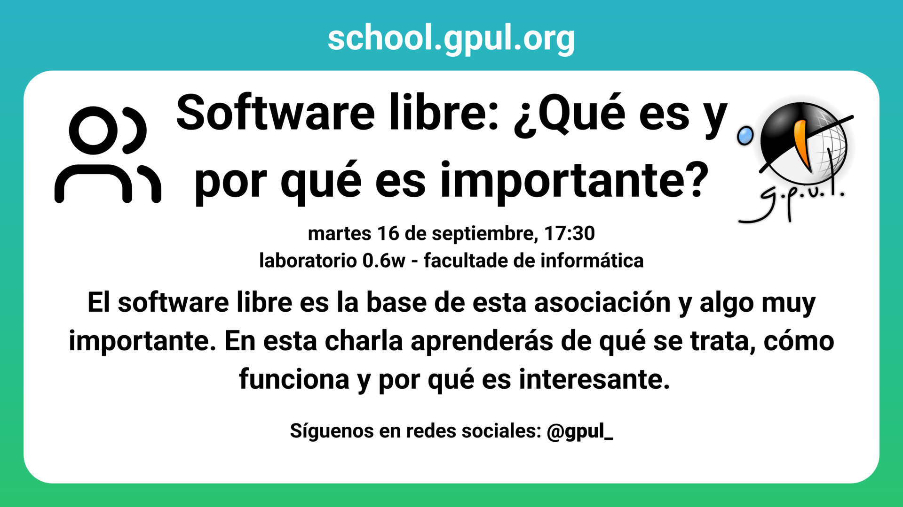

Empezamos las charlas de este cuatrimestre con una breve charla introductoria. Presentaremos a GPUL y explicaremos qué es el software libre.

Si aún no conoces GPUL o tienes curiosidad acerca del software libre, no te puedes perder esta charla que dará Pedro el próximo martes
